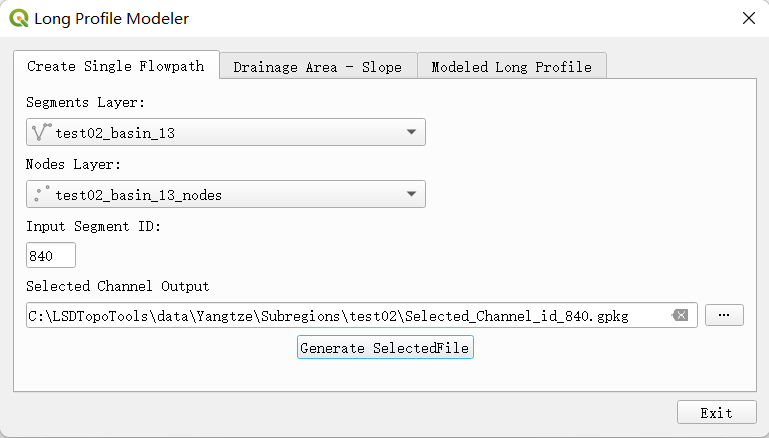

# LSDTopoTools 和 QGIS 进行河道分析
（本文档编辑于2023年，软件版本可能已经更新，请谨慎使用）

这里提供一种河道剖面提取和处理的开源解决方案，LSDTopoTools使用C++编写，在Linux下运行，能够达到大范围、快速提取河道的目的，QGIS作为最流行的开源交互方案，非常适合教学和论文发表，两者通过一些插件相结合，获得完美效果。  

**1\. 在Win11安装配置docker desktop**

安装的全过程参考视频参考Youtube： [https://www.youtube.com/watch?v=NHfqxx12kRs&list=WL&index=24&t=304s](https://www.youtube.com/watch?v=NHfqxx12kRs&list=WL&index=24&t=304s)

**1.1** 在官网下载Docker Desktop，由于win11使用了新的linux虚拟机内核，需要安装 wsl2更新包，参考相关的说明基于docker官方网站，

[https://docs.docker.com/desktop/install/windows-install/](https://docs.docker.com/desktop/install/windows-install/)

**1.2** 更新包的下载地址并安装，

[https://learn.microsoft.com/zh-cn/windows/wsl/install-manual#step-4---download-the-linux-kernel-update-package](https://learn.microsoft.com/zh-cn/windows/wsl/install-manual#step-4---download-the-linux-kernel-update-package)

**1.3** 按照步骤在终端（建议在微软商店里安装）里使用 wsl --set-default-version 2 命令将wsl2设置成默认版本

**1.4** 按照步骤在微软商店里安装ubuntu的发行版（这里使用22.04.1LTS版本），安装后打开自动以管理员运行（root开头），使用cat /etc/os-release命令查看ubuntu版本确认

**1.5** 此时不关闭ubuntu，打开终端使用wsl -l -v命令查看正在运行的虚拟机，会显示Ubuntu-22.04，这时再用wsl --set-default Ubuntu-22.04 命令设置Ubuntu为默认的linux虚拟机

**1.6** 打开docker desktop，在resources里面将WSL Integration里的第一项 Enable integration with my default WSL distro 勾去掉，把Ubuntu-22.04打开，完成了docker的设置


**2\. 安装LSDTopoTools**  

安装过程参考LSDTopoTools的文档，在docker的网站的lsdtopotools的网页上也有介绍

[https://lsdtopotools.github.io/LSDTT\_documentation/LSDTT\_installation.html](https://lsdtopotools.github.io/LSDTT_documentation/LSDTT_installation.html)

[https://hub.docker.com/r/lsdtopotools/lsdtt\_pcl\_docker](https://hub.docker.com/r/lsdtopotools/lsdtt_pcl_docker)

**2.1** 在C盘根目录下建一个目录，命名为LSDTopoTools

**2.2** docker 网站lsdtopotools网页上一共有一下几个镜像

lsdtt\_pcl\_docker：核心处理程序（早期版本）

lsdtt\_doc\_docker：说明

lsdtt\_viz\_docker：可视化工具，包括python的脚本

lsdtt\_alpine\_docker：冰川相关功能

lsdtt\_failtools\_docker：坡面分析，滑坡相关

lsdtt\_opencv\_docker：核心处理程序（新版本，包含了对河谷的分析）

lsdtt\_pytools\_docker：正在开发中的python语言写的lsdtopotools

这里对应河道的提取和chi分析，只需要安装opencv版本即可，其他类似。方法是，打开终端，输入以下命令

docker run --rm -it -v C:/LSDTopoTools:/LSDTopoTools lsdtopotools/lsdtt\_opencv\_docker

相关参数：-it 参数表示交互，-v 表示要添加的镜像和位置，这里的目标安装位置是LSDTopoTools目录，这个目录也是将来要处理的数据放置的目录

这个即是安装命令，也是运行的命令，如果发现要运行的容器不存在，就自动把镜像下载下来配置好，如果有画图的需要，也安装viz。

**2.3** 安装运行好后，在docker desktop中就可以看到镜像（Image）的状态是In use，在容器（Containers）会看到lsdtt\_opencv\_docker正在running。要想结束，就在终端里运行exit命令即可。


**3\. 用LSDTopoTools提取河道**

LSDTopoTools的核心命令只有几个，而且很多命令的功能参数都是通用的，也就是说，只要设置好参数文件，一个命令可以干很多事情。

lsdtt-basic-metrics：基础的dem处理，生成hillslope、坡度图等

lsdtt-channel-extraction：提取水系，设置几种水系提取方法，写入河道文本

lsdtt-chi-mapping：提取水系，并生成chi图，写入文本文件

lsdtt-valley-metrics

lsdtt-hillslope-channel-coupling

这里我们提取河道所用的是lsdtt-chi-mapping命令，运行docker中的lsdtt\_opencv\_docker容器后，在终端输入lsdtt-chi-mapping -h就可以在当前目录下生成一个html文件，介绍所有参数的用法。

**3.1 准备DEM文件**

在QGIS里，先将地理坐标WGS 84（经纬度）格式dem文件，用Raster: Reprojection: Warp进行投影变换到UTM下，中国一般用zone 46-48N的带号。

用Raster: Extraction: Clip raster by extent 切割成，包含所需流域的长方形区域，将生成的dem的layer右键Export: Save Feature As: 输出Tif格式。

**3.2 转换tif格式的DEM到bil格式**

LSDTopoTools接受的dem格式是ENVI的bil格式。在运行lsdtt\_opencv\_docker容器的终端中，可以直接使用 gdal\_translate -of ENVI filename.tif filename.bil 命令将tif文件转成ENVI的bil格式。

**3.3 修改参数文件**

用文本编辑器修改参数文本文件（如下），可以用UltraEdit，具有自动备份的功能，改错了也不怕。相关参数的解释可以参考lsdtt-chi-mapping的帮助html。

```bash
# Parameters for performing chi analysis
# Comments are preceded by the hash symbol
# Documentation can be found here:
# https://lsdtopotools.github.io/LSDTopoTools_ChiMudd2014/

# These are parameters for the file i/o
# IMPORTANT: You MUST make the write directory: the code will not work if it doesn't exist.
read path: ./
write path: ./
read fname: test02
write fname: test02
channel heads fname: NULL

# Parameter for filling the DEM
min_slope_for_fill: 0.0001

# Parameters for selecting channels and basins
threshold_contributing_pixels: 1000

minimum_basin_size_pixels: 5000
maximum_basin_size_pixels: 50000000
test_drainage_boundaries: false
find_largest_complete_basins: false
find_complete_basins_in_window: false

# The data that you want printed to file
print_d8_drainage_area_raster: true
write_hillshade: false
print_basin_raster: false
use_extended_channel_data: true
print_chi_data_maps: true
print_channels_to_csv: true
print_segments: true
print_segmented_M_chi_map_to_csv: false

# Chi analysis options
A_0: 1
m_over_n: 0.45
```
上面就是我用的参数parafile.param，这里输入的dem文件是当前目录下的test02.bil，直接名字test02即可。在终端中运行 lsdtt-chi-mapping parafile.param

结果会输出一个带chi值的csv文件，test02\_chi\_data\_map.csv，和一个河道文件，test02\_CN.csv。

如果DEM的分辨率很高，如30m或12.5m，则提取的河道点太多，会给后面的处理带来麻烦，可以适当增大threshold\_contributing\_pixels的值，默认是1000，可以增大很多，以避免产生过多的分支河道。


**3.4 利用lsdtt\_viz\_docker中的python脚本画图（可选）**

如果运行lsdtt\_viz\_docker容器，就可以用输出结果进行画图，例如用hillshade的dem和河道csv可以画很漂亮的图。具体可以参考说明文档

[https://lsdtopotools.github.io/LSDTT\_documentation/LSDTT\_visualisation.html](https://lsdtopotools.github.io/LSDTT_documentation/LSDTT_visualisation.html)

这里给一个命令行形式的使用示例，也可以将其保存成shell脚本，在终端下执行

python PlotBasicRasters.py -dir /LSDTopoTools/data/ExampleTopoDatasets/ChannelExtractionData/SantaCruz\_10m/ -out\_fname aspect -fname SCI\_DTM\_10m\_ASPECT -drape\_fname SCI\_DTM\_10m\_ASPECT -drape\_cbar\_label aspect -drape\_colour\_norm none -drape\_colour\_min\_max 0,360 -PD true -dpi 300


**4\. 用QGIS显示河道提取结果，并生成河道剖面**

**4.1 安装QGIS插件**

虽然QGIS可以直接导入csv文件，但是生成的点文件test02\_chi\_data\_map.csv（如下）直接导入后生成的河道点很难显示，而且河道也缺少标号，不易区分。

```bash
latitude,longitude,NI,receiver_NI,chi,elevation,flow_distance,drainage_area,source_key,basin_key,stream_order,receiver_junction,upstream_junction
31.7029962,110.363242,691071,687295,7.3874,1965,10719,1.7244e+06,0,0,1,477,652
31.7033458,110.362911,687295,683520,7.3084,1965,10668,1.741e+06,0,0,1,477,652
```
因此，需要用到一个QGIS插件， qgis\_lsdtt\_network\_tool，插件的功能是将上面的河道点文件转化为易显示的河道线文件。

[https://github.com/pjMitchell490/qgis\_lsdtt\_network\_tool](https://github.com/pjMitchell490/qgis_lsdtt_network_tool)

在github上下载zip包后，将文件夹解压到 C:\\Users\\用户名\\AppData\\Roaming\\QGIS\\QGIS3\\profiles\\default\\python\\plugins目录下，这里放的都是已经安装的插件。再到QGIS中的菜单Plugins: Manage and install Plugins下面找到插件的名字LSDTT Network Tool打上勾就可以使用了。

另外，如果要对剖面进行分析，比如进行Ksn的分析，还可以安装Long Profile Modeler插件，也很实用，下载地址是

[https://github.com/josie-welsh/QGIS-LongProfileModel-Plugin](https://github.com/josie-welsh/QGIS-LongProfileModel-Plugin)

为了后面更好的显示剖面和出图，还要安装两个插件，DataPlotly和ColorToAttribute，这个在Plugins: Manage and install Plugins下面直接搜索安装即可。

**4.2 使用LSDTT Network Tool 导入河道**

这里的Input CSV选择利用lsdtt-chi-mapping生成的test02\_chi\_data\_map.csv文件，输出文件是包含河道段segment的gpkg格式的矢量线文件，一定要勾选Export Node，可以同时输出\_nodes的gpkg文件，是与segment相匹配的点文件，用来绘制剖面图。


这时将生成的test02和test02\_nodes两个图层都加载到QGIS里，同时显示，用Identify Feature工具显示一下河道点和河道线的信息如下。


**4.3 标注河道文件，进行颜色分类显示，并创建颜色字段和赋值**

在线文件下面一个叫id的字段，对应于点文件中segment\_id的字段，这个例子里都是7011，这个id就是该河道的唯一编号。现在就可以针对线文件在Layer Styling里打开Single Label来选择用id来标注河道。而针对nodes点文件，在Symbol中选择Categorized按照segment\_id的value值进行随机颜色Classify，就可以使得不同河段标记为不同的颜色。之后利用ColorToAttribute插件将显示的颜色赋值到新的属性字段，例如取名color，就可以留作剖面时备用了。当然，如果点太多，赋值的时间就会很长，甚至只能完成一部分的赋值，这样可以分步完成，把完成赋值的部分选择-剪切成新的文件，然后再赋值剩下的部分，最后再把文件进行合并。


**4.4 DataPlotly绘制河道剖面**

在GIS的窗口中观察线文件，选择需要绘制的河道剖面，记住河道的id，在nodes点文件中选择segment\_id相同的河段进行绘制，这时在DataPlotly选择数据layer后对Feature Subset进行设置，


在Edit中用下面的表达式选择segment\_id为以下4个数值的河道

```bash
"segment_id" IN ('840','835','2777','3169')
```
选择好需要绘制的河道点后，在DataPlotly里进行设置坐标轴，例如画常规的河道纵剖面，横轴X选择flow\_distance字段，纵轴Y选择elevation字段，还可以进行绘图点和线的样式的设置，标题，这些都符合Plotly的绘图规范。如果按照默认的样式将会产生下面的剖面图，但是效果很显然不够好，无法分清哪个河段。


我们希望用对应的颜色进行区分，这时需要对样式进行设置，使其与QGIS中的河段颜色相一致，需要在Marker Color中进行设置，将来源设置为Field type中的color字段，也就是我们前面赋值颜色值的字段，这样一来我们就可以得到与QGIS中相一致的河道剖面颜色显示。相同的道理，我们也可以得到chi-elevation的剖面，同时可以选择添加子图的模式，同时显示两个图，例如最下面的图中左侧为常规的高程剖面图，右侧为chi图。是不是很完美？


**4.5 利用Long Profile Modeler对河道剖面进行拟合**

根据segment id的值选择河道的源头，将流域内的完整的河道提取出来，比如我们这里选择了源头segment\_id为840的河段。通过Creat Single Flowpath就可以将其从源到汇的整条河生成一个文件。以这个文件数据为基础，可以进行面积-坡度的log图分析，确定ksn和theta值，建立稳态的河道剖面方程。具体原理和细节这里不再赘述，可以参考wobus（2006）的文章或我的博士论文。


